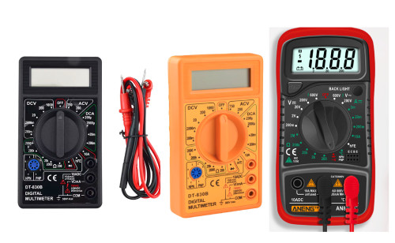
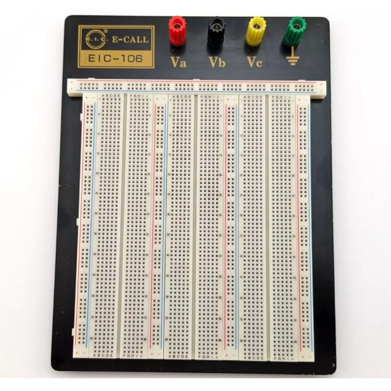
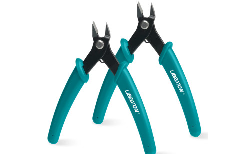
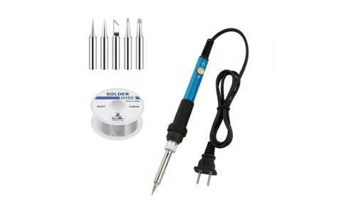
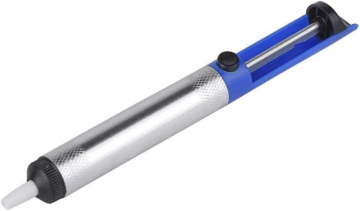
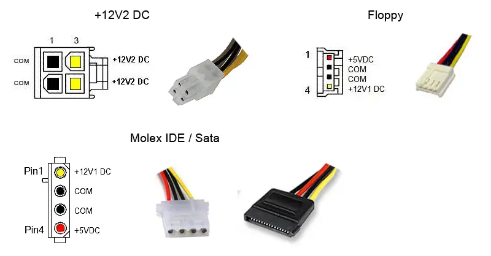
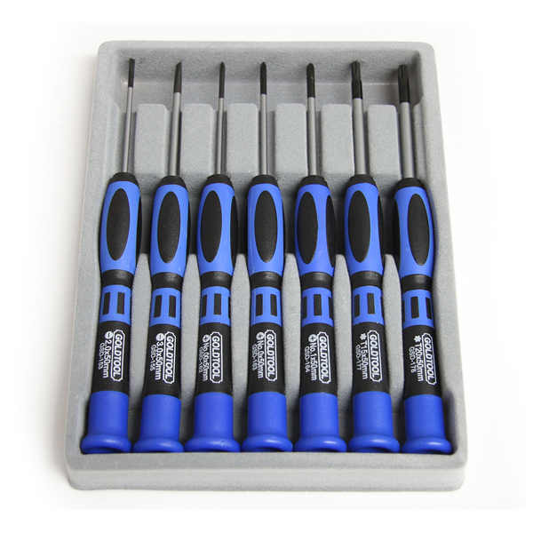

# **Electrónica para Principiantes**

( Más orientada a microcontroladores )

No profundizaremos demasiado en teoría, sino que te daremos una guía práctica para iniciarte en el fascinante mundo de la electrónica.  

Aquí encontrarás las herramientas esenciales y conceptos básicos para dar tus primeros pasos.  

---

## **Adquisición de Herramientas Imprescindibles**  

- **Multímetro**  
- **Placa Protoboard**  
- **Pinzas**  
- **Alicates de corte**  
- **Soldador y estaño**  
- **Desoldador de mano**  
- **Fuente de alimentación**  
- **Destornilladores de precisión (relojero)**  

---  

### **1. Multímetro**  
Un modelo básico es suficiente para empezar, ya que son económicos y versátiles.  

  

---  

### **2. Placa Protoboard**  
Ideal para probar circuitos sin soldar. Recomendable comprarla con cables de conexión (jumper wires).  

  

---  

### **3. Pinzas**  
Útiles para manipular componentes pequeños con precisión.  

  

---  

### **4. Alicates de Corte y de Sujección**  
Especializados para cortar pines de componentes. **No los uses para materiales duros** o perderán su filo.

  

También nos pude venir vien unos pequeños alicates de sujeccíon o agarre.

  

---  

### **5. Soldador, Estaño y Desoldador**  
**Soldador sin plomo (RoHS)**.  

#### 🔥 **Aleaciones comunes y puntos de fusión**:  
- **Sn-Cu (99.3/0.7)**: 227°C  
- **SAC305 (Sn-Ag-Cu)**: 217–221°C  
- **SAC387 (Sn-Ag-Cu)**: 217–225°C  

⚠️ **Consejo**: Usa *flux* para mejorar la soldadura.  

  
  

---  

### **6. Fuente de Alimentación**  
**Opción económica**: Recicla una fuente de PC (cables útiles: **rojo (+5V)**, **amarillo (+12V)**, **negro (GND)**).  

  

**Opción profesional**: Fuente variable (ej: 0–30V, 0–5A/10A).  

  

---  

### **7. Destornilladores de Precisión**  
Para tornillos pequeños. Si necesitas más fuerza, añade un juego de destornilladores estándar.  

  

---  

