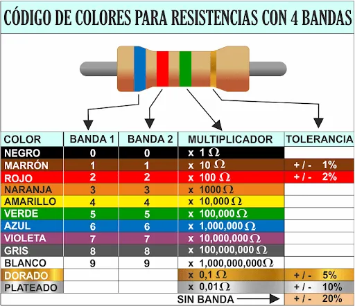
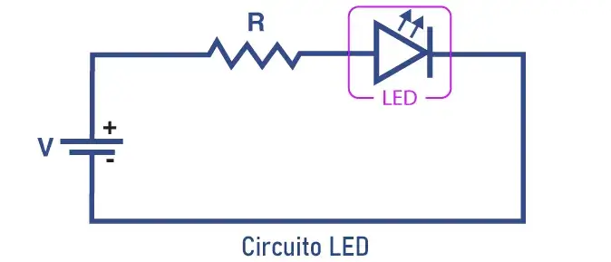

# **Electrónica para Principiantes**

(Orientada a microcontroladroes Arduino...)
---

## **MÓDULO 1 - Adquisición de Herramientas Imprescindibles**  

- **Multímetro**  
- **Placa Protoboard**  
- **Pinzas**  
- **Alicates de corte**  
- **Soldador y estaño**  
- **Desoldador de mano**  
- **Fuente de alimentación**  
- **Destornilladores de precisión (relojero)**  

---  

### **1. Multímetro**  
Un modelo básico es suficiente para empezar, ya que son económicos y versátiles.  

  

---  

### **2. Placa Protoboard**  
Ideal para probar circuitos sin soldar. Recomendable comprarla con cables de conexión (jumper wires).  

  

---  

### **3. Pinzas**  
Útiles para manipular componentes pequeños con precisión.  

  

---  

### **4. Alicates de Corte y de Sujección**  
Especializados para cortar pines de componentes. **No los uses para materiales duros** o perderán su filo.

  

Pequeños alicates de sujeccíon o agarre.

  


---  

### **5. Soldador, Estaño y Desoldador**  
**Soldador sin plomo (RoHS)**.  

#### 🔥 **Aleaciones comunes y puntos de fusión**:  
- **Sn-Cu (99.3/0.7)**: 227°C  
- **SAC305 (Sn-Ag-Cu)**: 217–221°C  
- **SAC387 (Sn-Ag-Cu)**: 217–225°C  

⚠️ **Consejo**: Usa *flux* para mejorar la soldadura.  

  
  

---  

### **6. Fuente de Alimentación**  
**Opción económica**: Recicla una fuente de PC (cables útiles: **rojo (+5V)**, **amarillo (+12V)**, **negro (GND)**).  

  

**Opción profesional**: Fuente variable (ej: 0–30V, 0–5A/10A).  

  

---  

### **7. Destornilladores de Precisión**  
Para tornillos pequeños. Si necesitas más fuerza, añade un juego de destornilladores estándar.  

  

---  

# **Módulo 2: Conceptos Básicos de Electrónica**  
*(Fundamentos esenciales antes de programar microcontroladores)*  

---

## **1.1 Voltaje, Corriente y Resistencia**  

### **🔌 Conceptos Clave**  
- **Voltaje (V)**: (unidad: Voltios).  
  - Ejemplo: Una batería de 9V tiene una diferencia de potencial de 9 voltios entre sus polos.  
- **Corriente (I)**: Flujo de electrones (unidad: Amperios).  
  - **¡Cuidado!**: Corrientes altas (>100mA) pueden dañar componentes.  
- **Resistencia (R)**: Oposición al flujo de corriente (unidad: Ohmios Ω).  

### **⚡ Ley de Ohm**  
Fórmula fundamental:  
```  
V = I × R  
```  
- **Ejemplo práctico**: Si un LED necesita 20mA (0.02A) y usamos una batería de 5V que resistencia necesitaremos:  
  ```  
  R = V / I = 5V / 0.02A = 250 Ω  
  ```  
  *(Usaríamos una resistencia estándar de 220Ω o 330Ω).*  

### **📏 Uso del Multímetro**  
| **Funciòn** | **Què mide** | **Còmo usarlo** |  
|-------------|--------------|----------------|  
| **Voltaje (DC/AC)** | Diferencia de potencial entre dos puntos | Colocar puntas en paralelo al componente |  
| **Corriente (A)** | Flujo de electrones | Interrumpir el circuito y conectar en serie |  
| **Resistencia (Ω)** | Valor de resistencias | ⚠️Medir con componente desconectado |  
| **Continuidad** | Cortocircuitos o conexiones rotas | Pitará si hay conexión (resistencia ≈ 0Ω) ⚠️Medimos sin alimentar el circuito  |  

**⚠️ Precaución**: Nunca midas corriente en paralelo (podrías quemar el multímetro) y asegurate el rango de trabajo también (A  mA  uA).  

---

## **1.2 Componentes Básicos**  

### **🎨 Resistencias y Código de Colores**  
- **Cálculo rápido**:  
    
  - Ejemplo: **Amarillo (4) - Violeta (7) - Rojo (×100) = 4700 Ω (4.7kΩ)**.  

- **Usos comunes**:  
  - Limitar corriente a LEDs.  
  - Dividir voltaje (divisor de tensión).  

### **💡 LEDs y Resistencias Limitadoras**  
- **Polaridad del LED**:  
  - **Ánodo (+)**: Pata más larga.  
  - **Cátodo (-)**: Lado plano del LED.  
- **Fórmula para calcular la resistencia del LED**:  
  ```  
  R = (V_fuente - V_LED) / I_LED  
  ```  
  - *Ejemplo*: Batería 5V, LED rojo (2V, 20mA):  
    ```  
    R = (5V - 2V) / 0.02A = 150 Ω  
    ```  

### **🔘 Pulsadores e Interruptores**  
- **Tipos**:  
  - **NA (Normalmente Abierto)**: Sólo cierra circuito al presionar.  
  - **Pull-up/Pull-down**: Evitan estados "flotantes" en microcontroladores.  
    ```cpp  
    // Ejemplo en Arduino (pull-up interno):  
    pinMode(boton, INPUT_PULLUP);  
    ```  

### **🛠️ Protoboard: Conexiones Básicas**  

#### **🔹 Estructura Básica**  
- **Agujeros estándar**: Espaciados a **2.54 mm** (para componentes como ICs, resistencias, LEDs).  
- **Filas centrales**:  
  - **5 agujeros por fila** conectados **horizontalmente** (pero **no entre columnas**).  
  - Ideal para insertar **circuitos integrados (ICs)** en la ranura central.  
- **Barras laterales (rojo/azul)**:  
  - Usadas para **alimentación (+Vcc)** y **tierra (GND)**.  
  - Conexión **vertical** (normalmente 25 agujeros por barra, a veces divididas en mitades).  

#### **🔹 Conexiones Internas**  
- **Filas horizontales (ej: A-E)**:  
  ```  
  A1-B1-C1-D1-E1 → Conectados entre sí.  
  F1-G1-H1-I1-J1 → Conectados entre sí (pero NO con A1-E1).  
  ```  
- **Barras laterales**:  
  ```  
  Todos los agujeros "rojos" (+) están conectados en una columna.  
  Todos los azules (-) en otra.  
  ```  

#### **🔹 Cómo Usarla**  
1. **Alimentación**: Conecta **+Vcc** (rojo) y **GND** (azul) a las barras laterales.  
2. **Componentes**: Inserta patas o cables en **agujeros de la misma fila** para conectarlos.  
3. **ICs**: Colócalos **sobre la ranura central** (cada pin quedará en una fila independiente).  

#### **⚠️ Consejos Clave**  
- Usa **cables rígidos AWG 22-26** (0.4–0.6 mm de diámetro) para conexiones seguras.  
- Verifica conexiones con un **multímetro** (modo continuidad) si hay dudas.  
- **Evita cortocircuitos**: No conectes +Vcc y GND en la misma fila horizontal.  


#### **⚠️ Las protoboards no sirven para circuitos de alta frecuencia o corrientes altas (>1A). ¡Son solo para prototipado rápido!**
---

## **🔹 Práctica: Circuito LED + Resistencia + Batería**  

    


### **Materiales**:  
- 1 LED rojo (2V).  
- 1 Resistencia de 220Ω.  
- Batería de 5V.  
- Protoboard y cables.  

### **Pasos**:  
1. Conecta el **ánodo del LED** (pata larga) a la **resistencia**.  
2. Une la resistencia al **positivo (+) de la batería**.  
3. Conecta el **cátodo del LED** (pata corta) al **negativo (-)**.  
4. ¡El LED debe encenderse!  

**💡 Reto opcional**:  
- Mide el voltaje en el LED con el multímetro (debe ser ≈2V).  
- Cambia la resistencia a 470Ω y observa cambios en el brillo.  

---

## **📌 Resumen del Módulo 1**  
- **Ley de Ohm**: Relaciona voltaje, corriente y resistencia.  
- **Multímetro**: Herramienta clave para medir y diagnosticar.  
- **Componentes pasivos**: Resistencias, LEDs, pulsadores.  
- **Protoboard**: Base para prototipado rápido.  

**⬆️ Siguiente módulo**: Entradas/Salidas digitales con microcontroladores.  

--- 

**¿Dudas?** Revisa estos simuladores para practicar sin riesgos:  
- [Tinkercad Circuits](https://www.tinkercad.com/circuits)  
- [Falstad Circuit Simulator](https://falstad.com/circuit/)  

¿Quieres profundizar en algún tema en particular? 😊
